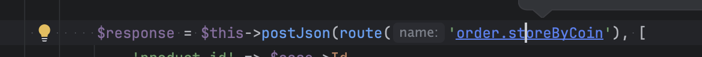

# Phpstorm plugin laravel-route
Easy navigate by route name to controllers.

## Support
- Runtime 27.0.7.
- Phpstorm 2025.*

## Build
-  ``./gradlew buildPlugin``
- ``ls -la build/distributions/``
- You should see something like laravel-route-navigator-1.0.0.zip

## Install
- Open phpstorm
- Settings / Plugins / Install from Disk and select zip file.
- or use ready build [laravel-route-navigator-1.0.0.zip](laravel-route-navigator-1.0.0.zip)

